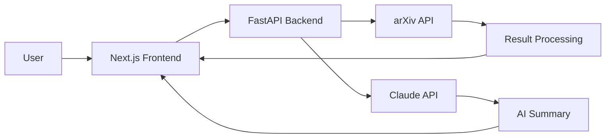

# ArXiv Scholar AI

> AI-powered research paper discovery and summarization with a modern full-stack web app.

| | |
|---|---|
| **GitHub** | [github.com/hirenpurabiya/arxiv-scholar-ai](https://github.com/hirenpurabiya/arxiv-scholar-ai) |
| **Live Demo** | [arxiv-scholar-ai.vercel.app](https://arxiv-scholar-ai.vercel.app) |
| **Status** | Live |

## Tech Stack

- **Frontend:** Next.js 16, React, TypeScript, Tailwind CSS
- **Backend:** Python, FastAPI, Pydantic
- **AI:** Anthropic Claude (summarization)
- **Data:** arXiv API
- **Hosting:** Vercel (frontend) + Render (backend)

## Architecture

## What It Does

Search arXiv's database of 2M+ academic papers on any topic and get concise AI-powered summaries using Claude. Features a beautiful responsive UI, direct PDF links, topic-based organization, and a full REST API backend.

## Key Features

- Search arXiv's 2M+ papers by any topic with smart relevance ranking
- AI-powered summaries using Claude -- concise, readable explanations of complex research
- Direct PDF download links for every paper
- Topic-based organization -- articles saved and grouped for easy revisiting
- Full REST API backend with interactive Swagger documentation
- Modern, responsive UI built with Next.js and Tailwind CSS
- Learning journal documenting CS/AI/ML concepts explained simply

---

*Full project: [github.com/hirenpurabiya/arxiv-scholar-ai](https://github.com/hirenpurabiya/arxiv-scholar-ai)*
