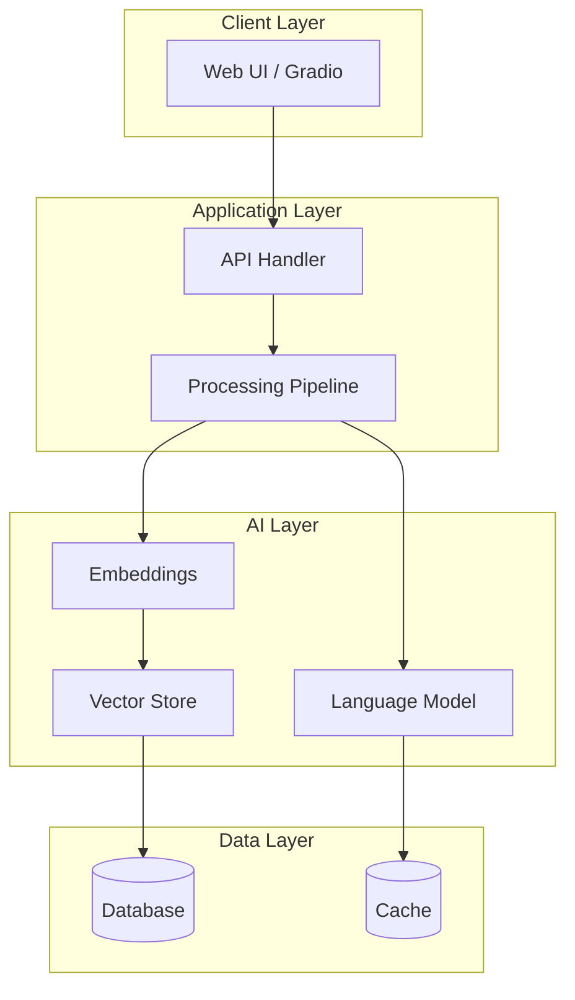
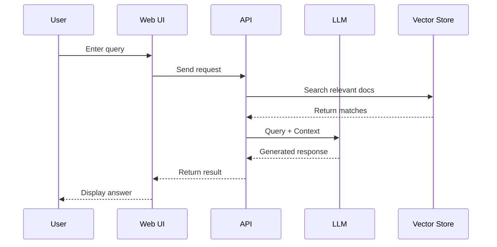

# Architecture Design

## System Overview

Brief description of the system and its purpose.

## High-Level Architecture

## Component Details

### 1. Client Layer
- **Technology:** Gradio / Streamlit / React
- **Purpose:** User interface for interaction
- **Key Features:** Input handling, result display

### 2. Application Layer
- **API Handler:** Receives requests, validates input
- **Processing Pipeline:** Orchestrates the workflow

### 3. AI Layer
- **Embeddings:** Convert text to vectors (e.g., OpenAI, sentence-transformers)
- **Language Model:** Generate responses (e.g., GPT-4, Claude, Llama)
- **Vector Store:** Store and retrieve embeddings (e.g., Pinecone, ChromaDB)

### 4. Data Layer
- **Database:** Persistent storage
- **Cache:** Performance optimization

## Data Flow

## Design Decisions

### Why [Technology X]?
- Reason 1
- Reason 2

### Trade-offs Considered
| Option | Pros | Cons | Decision |
|--------|------|------|----------|
| Option A | Fast | Expensive | |
| Option B | Cheap | Slower | ✓ |

## Security Considerations

- API keys stored in environment variables
- Input sanitization
- Rate limiting on public demos

## Scalability

- Current: Single instance on Hugging Face Spaces
- Future: Could scale with [approach]

## Cost Analysis

| Component | Provider | Cost |
|-----------|----------|------|
| Hosting | Hugging Face | Free |
| LLM API | OpenAI | ~$X/1K requests |
| Vector DB | ChromaDB (local) | Free |

---

*Last updated: [Date]*
