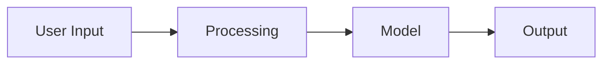

# Project Name

> One-line description of what this project does.

## Problem Statement

What problem does this solve? Why is it important?

## Demo

**Live Demo:** [Try it on Hugging Face](https://huggingface.co/spaces/hirenpurabiya/project-name)


## Architecture



## Tech Stack

- **Language:** Python 3.11
- **Framework:** [LangChain/PyTorch/etc.]
- **Model:** [GPT-4/Claude/Llama/etc.]
- **Deployment:** Hugging Face Spaces

## Key Features

- Feature 1
- Feature 2
- Feature 3

## How It Works

1. Step 1: User provides input
2. Step 2: System processes...
3. Step 3: Model generates...
4. Step 4: Output returned

## Installation

```bash
# Clone the repository
git clone https://github.com/hirenpurabiya/ai-portfolio.git
cd ai-portfolio/projects/project-name

# Install dependencies
pip install -r requirements.txt

# Run locally
python src/main.py
```

## Usage

```python
from project import main_function

result = main_function(input_data)
print(result)
```

## Results & Metrics

| Metric | Value |
|--------|-------|
| Accuracy | XX% |
| Latency | XXms |

## What I Learned

- Key insight 1
- Key insight 2
- Challenge faced and how I solved it

## Future Improvements

- [ ] Improvement 1
- [ ] Improvement 2

## References

- [Paper/Blog/Course that inspired this](link)

---

*Built as part of my AI/ML learning journey. Feedback welcome!*
